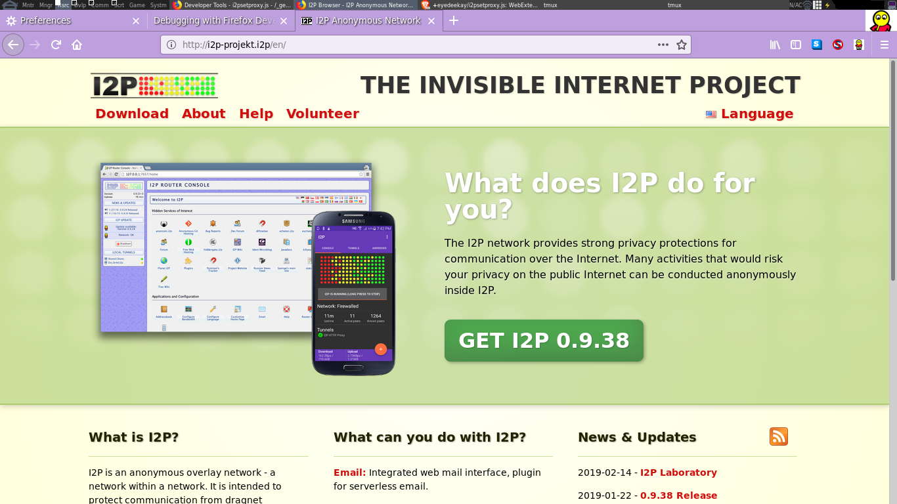

i2psetproxy.js
==============

WebExtension that does extended configuration of a dedicated i2p browser. It's
still not good enough to use on it's own, and should be combined with the Tor
Browser or the I2P Firefox Profile for now.

Features
--------

  * [done] **Indicate** the i2p browser is in use verbally and symbolically.
  * [done] **Set** the http proxy to use the local i2p proxy
  * [done] **Disable** risky webRTC features
  * [done] **Change** the color of the browser window to indicate that i2p is in use
  * [done-ish] **Reset** the HTTP Proxy tunnel to generate a new destination on-demand
   * it does this by working in conjunction with this [standalone HTTP proxy](https://github.com/eyedeekay/httptunnel), currently disabled*
  * [ready] **Provide** help in a variety of languages.

Usage with standalone HTTP Proxy
--------------------------------

This functionality is currently disabled.

I developed a simple HTTP proxy that can be used with this extension to enable the
user to initiate a re-start of the HTTP proxy tunnel, with a new set of keys and a
new destination. This, combined with re-setting the browser settings back to the
original defaults(which is also done by the HTTP Proxy when re-initiated), amounts
to a "Fresh Identity" feature for the I2P browser.

Before you begin, get the [Standalone HTTP proxy from here](http://github.com/eyedeekay/httptunnel)
and run it like so:

        httpproxy -littleboss=start

You can also use 'go get'

        go get -u github.com/eyedeekay/httptunnel/httpproxy

If you change the default host and port, you will need to alter the following guide.

In order to use it with the custom HTTP proxy, open the "Add-On's" menu and select
the options for the i2psetproxy.js plugin. Change the "Proxy" configuration from

        Host: 127.0.0.1
        Port: 4444

to

        Host: 127.0.0.1
        Port: 7950

and change the "Control" configuration from:

        Host: 127.0.0.1
        Port: 4444

to

        Host: 127.0.0.1
        Port: 7951

Now, when you press the Toopie button in the toolbar, you will see in the output
of the HTTP proxy that it has been re-started.

Screenshot
----------

